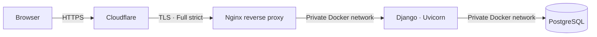

# Midnight Library

A production-deployed library management system built with Django and
PostgreSQL. It supports catalogue management, borrowing workflows, user roles,
inventory control, and secure public access through a Cloudflare-protected VPS.

**Live application:** [midnightlibrary.pedrocrlx.pt](https://midnightlibrary.pedrocrlx.pt)

## Overview

Midnight Library models the day-to-day operations of a small library. Users can
search the catalogue, borrow available books, track due dates, and return them.
Administrators have a dedicated interface for managing books, categories, and
inventory.

The project was also built as a practical production deployment exercise: the
application runs in isolated Docker services behind Nginx, with end-to-end TLS,
restricted origin access, non-root application execution, and persistent
PostgreSQL storage.

## Features

### Readers

- Register and sign in with role-based access.
- Browse and search books by title or author.
- Borrow available books, with a maximum of three active loans.
- Prevent duplicate loans and borrowing out-of-stock books.
- Track borrowed books and due dates from a personal dashboard.
- Return books and restore their inventory automatically.

### Administrators

- View library and borrowing statistics.
- Add, update, and remove books.
- Manage book quantities and availability.
- Create categories and associate them with books.
- Review active borrowing records.

## Architecture



- **Cloudflare** provides proxied DNS, edge TLS, and protection for the public
  endpoint.
- **Nginx** is the only service exposing ports `80` and `443`; it terminates TLS,
  applies request limits and security headers, serves static files, and proxies
  application traffic.
- **Django/Uvicorn** runs as a non-root user and is reachable only inside the
  Docker network.
- **PostgreSQL** has no published host port and stores data in a persistent
  Docker volume.
- **Host firewall rules** accept web traffic only from Cloudflare's published IP
  ranges, preventing direct access to the origin over HTTP or HTTPS.

## Engineering highlights

- Multi-stage Python image based on `python:3.12-slim`.
- Poetry is used during dependency installation but excluded from the production
  runtime image.
- Production image reduced from approximately **1.94 GB to 261 MB** in local
  Docker measurements.
- Separate development and production Compose configurations.
- Environment-based Django configuration with production HTTPS, cookie, CSRF,
  host validation, and HSTS settings.
- Cloudflare Origin CA certificate with **Full (strict)** TLS between Cloudflare
  and Nginx.
- Nginx rate limiting, connection limiting, request-size limits, and hardened
  response headers.
- UFW plus `DOCKER-USER` rules to prevent Docker port publishing from bypassing
  the host firewall.
- Automated migrations and static asset collection during production startup.
- Secrets, environment files, certificates, caches, and development artefacts
  excluded from both Git and the Docker build context.

## Domain model

| Entity | Responsibility |
| --- | --- |
| `Users` | Reader identity, credentials, and application role |
| `Books` | Catalogue metadata, cover URL, and available quantity |
| `Categories` | Reusable book classifications |
| `CategoriesPerBook` | Many-to-many association between books and categories |
| `BooksBorrowed` | Loan record linking a reader to a book and due date |

The borrowing workflow enforces inventory availability, prevents duplicate
active loans, and limits each reader to three borrowed books.

## Technology

| Area | Technology |
| --- | --- |
| Backend | Python 3.12, Django 5.2, Uvicorn |
| Database | PostgreSQL 17 |
| Reverse proxy | Nginx |
| Edge and DNS | Cloudflare |
| Containers | Docker, Docker Compose |
| Dependencies | Poetry |
| Tests | Pytest, Pytest-Django |
| Host | Ubuntu 22.04 VPS |

## Testing

The integration suite covers:

- Public catalogue access and search.
- Registration, login, and logout.
- Borrowing limits and stock validation.
- Duplicate-loan prevention.
- Returning books.
- Administrative CRUD and authorization.

Run it locally with:

```bash
make test
```

## Local development

Requirements: Docker with Docker Compose, plus Make if using the convenience
commands.

```bash
cp example.env .env
make run
```

The development application is available at
[http://localhost:8000](http://localhost:8000). Development uses a dedicated
Docker build target with test dependencies, while production uses the minimal
non-root runtime target.

## Roadmap

- Provision VPS and Cloudflare resources with Terraform.
- Move service orchestration to Kubernetes/K3s.
- Add CI/CD for tested, repeatable deployments.
- Add centralized monitoring, logs, and automated backup verification.

## License

Licensed under the [MIT License](LICENSE).
